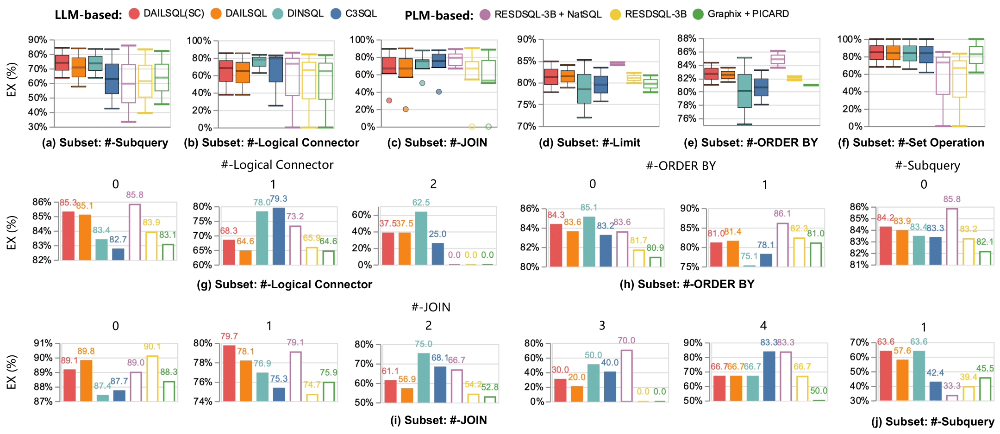
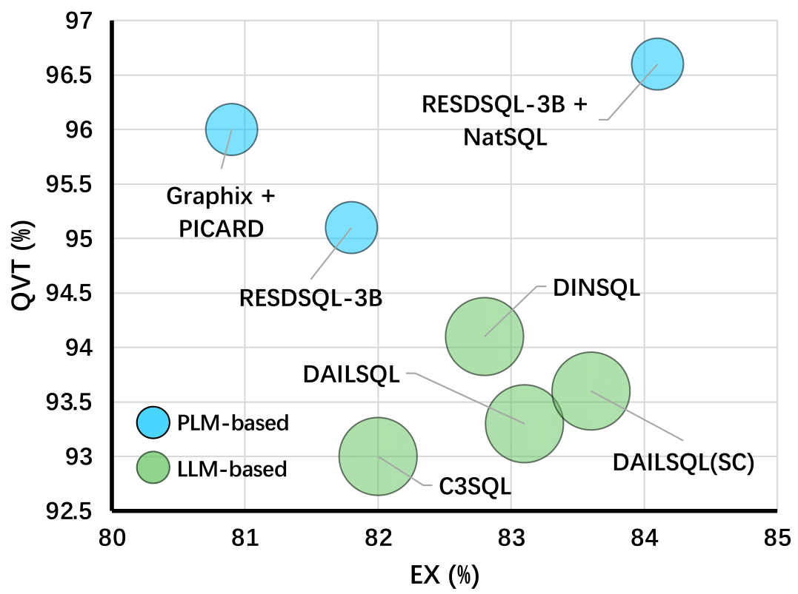
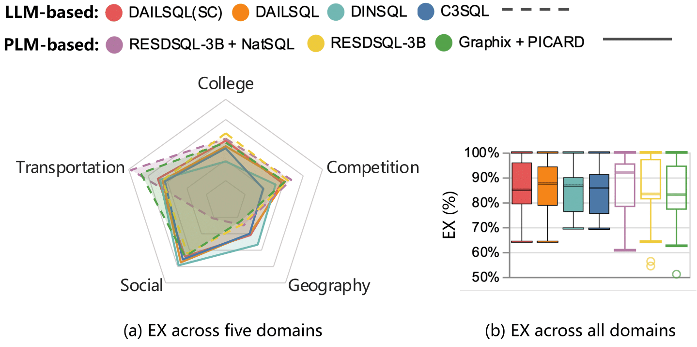

# NLSQL360

<div align="center"></div>

## Overview

**NLSQL360** is a testbed for fine-grained evaluation of NL2SQL solutions. Our testbed integrates existing NL2SQL benchmarks, a repository of NL2SQL models, and various evaluation metrics, which aims to provide an intuitive and user-friendly platform to enable both standard and customized performance evaluations. Users can utilize **NLSQL360** to assess different NL2SQL methods against established benchmarks or tailor their evaluations based on specific criteria. This flexibility allows for testing solutions in specific data domains or analyzing performance on different characteristics of SQL queries. 

In addition, we propose **SuperSQL**, which achieves the top rank on the Spider-test leaderboard with an execution accuracy of **87%**.

## Environment Setup

Create a virtual anaconda environment:

```
conda create -n nlsql360 python=3.9
```

Active it and install the requirements:

```
pip install -r requirements.txt
python -c "import nltk;nltk.download('punkt')" 
```

## Data Preparation

You need to download specific dataset and unzip to the folder `./data/dataset/{DATASET}`. For example, you can download and unzip the [Spider](https://yale-lily.github.io/spider) to the folder `./data/dataset/spider`.

## Run

For Spider:

```
python spider_example.py
```

For BIRD:

```
python bird_example.py
```

## Experiments

#### Execution Accuracy vs. SQL Characteristics

Our **NLSQL360** supports sql query filtering based on individual sql clauses, their combinations, or user-defined conditions. We demonstrate only four representative aspects based on Spider-dev dataset. We run all methods on these four subsets of sql queries and compute the Execution Accuracy (EX) metric.



#### Query Variance Testing

This set of experiments aims to evaluate the nl2sql system’s adaptability to various natural language phrasings and structures, reflecting the diversity anticipated in practical applications. To this end, we evaluate different LLM-based and PLM-based methods on the Spider dataset. We use our proposed **Query Variance Testing (QVT)** metric for this evaluation. **Although the LLM-based method performs well in many scenarios, its effectiveness on Query Variance Testing is unexpectedly inferior to the PLM-based methods.**

<div align="center"></div>

#### Database Domain Adaption

In practical nl2sql applications, scenarios typically involve domain-specific databases, like movies or sports, each with unique schema designs and terminologies. Assessing the detailed performance of methods across these domains is crucial for effective model application. In this set of experiments, we classified the 140 databases in the Spider train set and the 20 databases in the development set into 33 domains, including social and geography, among others. We measured the performance of methods across different domain subsets in the Spider development set using the Execution Accuracy (EX) metric. **Different NL2SQL methods exhibit varying biases towards different domains, with even the same method potentially showing significant performance variations across different domains. Furthermore, LLM-based methods tend to have more stable adaptation across different domains compared to PLM-based methods.**

<div align="center"></div>
