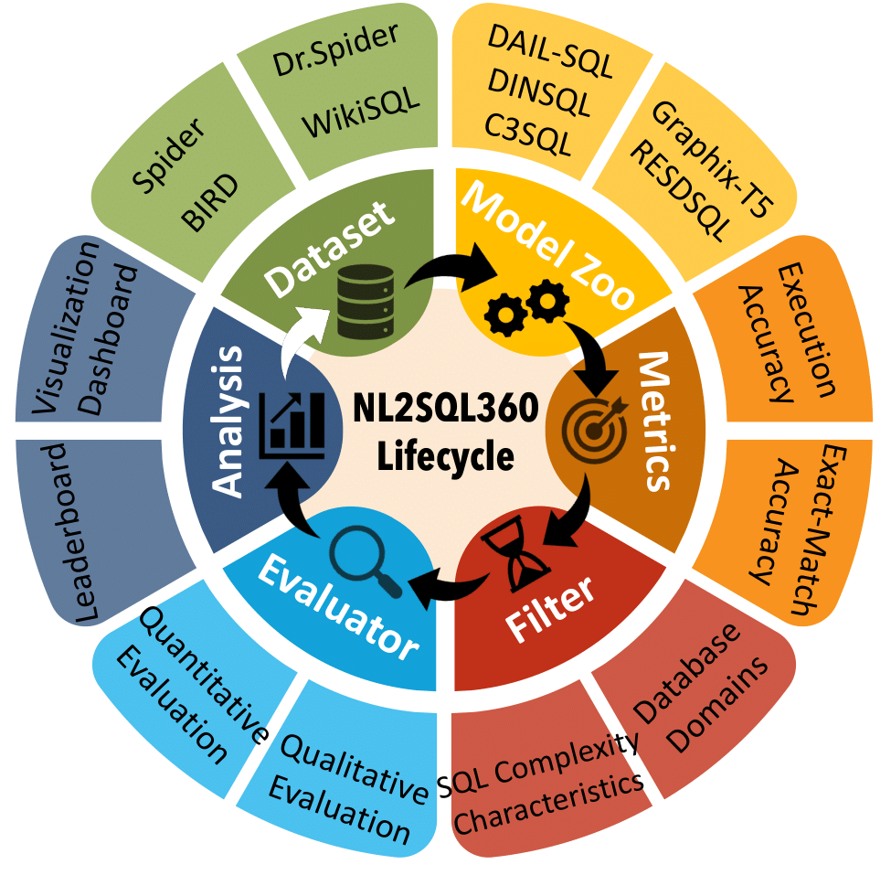
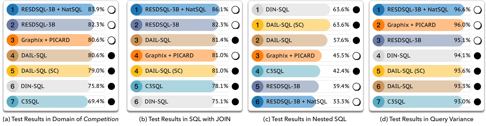

# NLSQL360

<div align="center"></div>

## Overview

**NLSQL360** is a testbed for fine-grained evaluation of NL2SQL solutions. Our testbed integrates existing NL2SQL benchmarks, a repository of NL2SQL models, and various evaluation metrics, which aims to provide an intuitive and user-friendly platform to enable both standard and customized performance evaluations. Users can utilize **NLSQL360** to assess different NL2SQL methods against established benchmarks or tailor their evaluations based on specific criteria. This flexibility allows for testing solutions in specific data domains or analyzing performance on different characteristics of SQL queries. 

In addition, we propose **SuperSQL**, which achieves the top rank on the Spider-test leaderboard with an execution accuracy of **87%**.

## Environment Setup

Create a virtual anaconda environment:

```
conda create -n nlsql360 python=3.9
```

Active it and install the requirements:

```
pip install -r requirements.txt
```

## Data Preparation

You need to download specific dataset and unzip to the folder `./data/dataset/{DATASET}`. For example, you can download and unzip the [Spider](https://yale-lily.github.io/spider) to the folder `./data/dataset/spider`.

## Run

### Data Preprocess

```
from engine.engine import Engine

```

