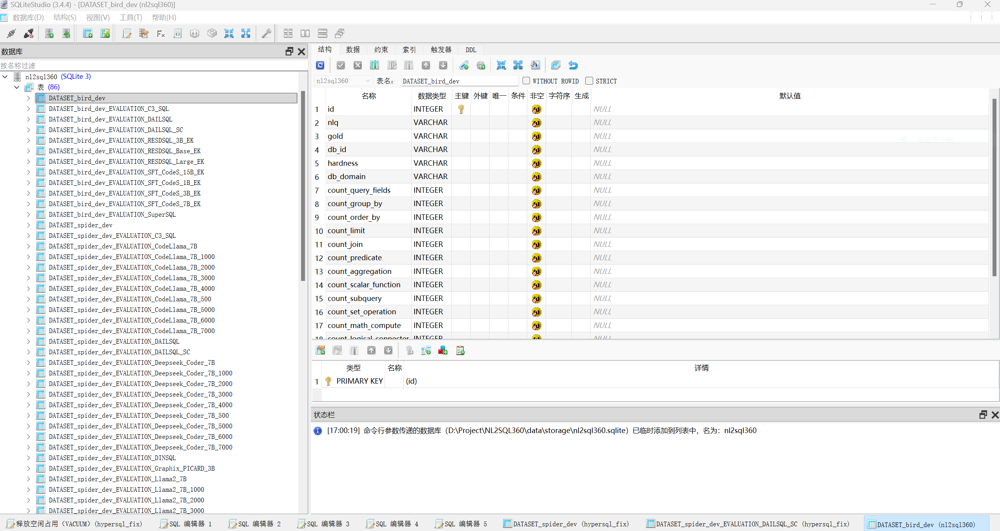
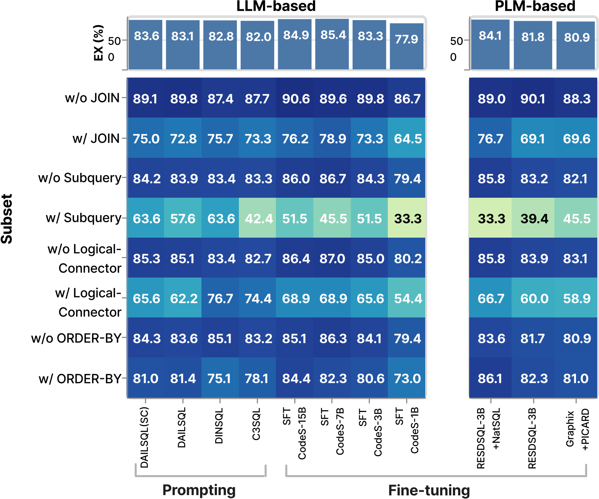
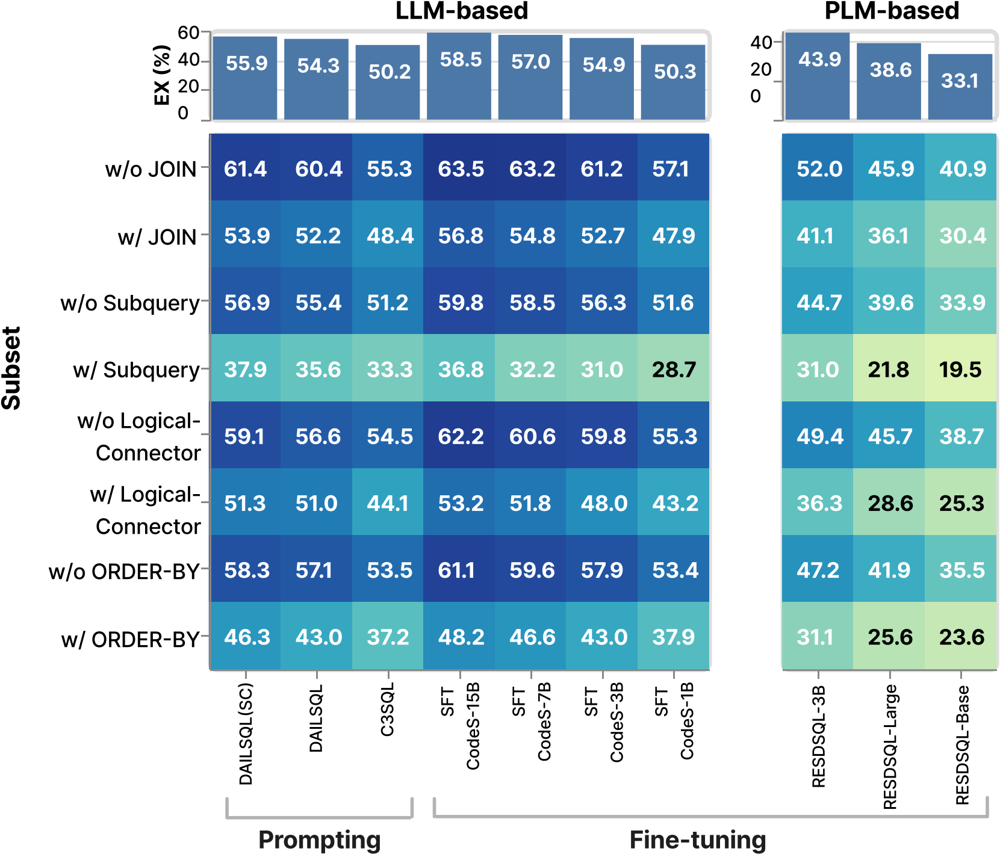
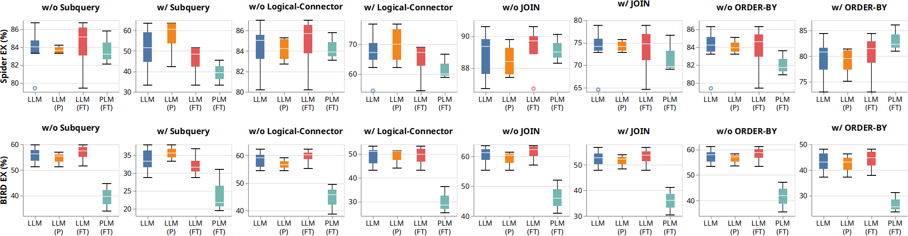
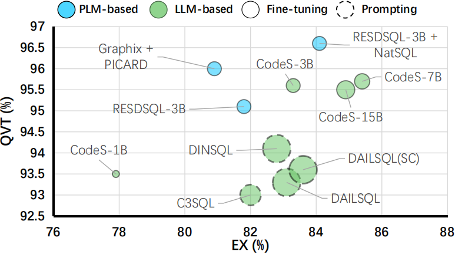
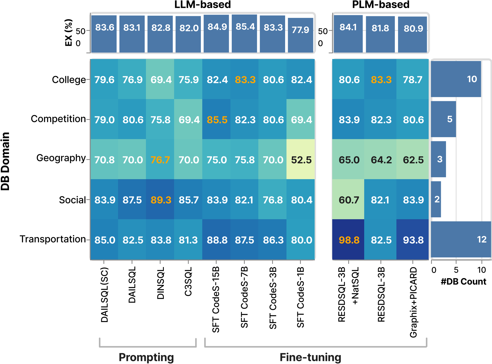
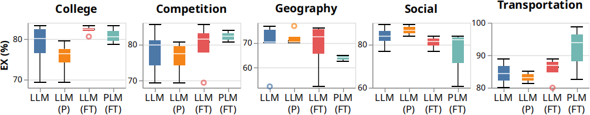

# :mag_right:NL2SQL360

<div align="center"></div>

## :dizzy:Overview

**NL2SQL360** is a testbed for fine-grained evaluation of NL2SQL solutions. Our testbed integrates existing NL2SQL benchmarks, a repository of NL2SQL models, and various evaluation metrics, which aims to provide an intuitive and user-friendly platform to enable both standard and customized performance evaluations. Users can utilize **NL2SQL360** to assess different NL2SQL methods against established benchmarks or tailor their evaluations based on specific criteria. This flexibility allows for testing solutions in specific data domains or analyzing performance on different characteristics of SQL queries. 

In addition, we propose **SuperSQL**, which achieves competitive performance with execution accuracy of **87%** and **62.66%** on the Spider and BIRD test sets, respectively.

## :tada:News
[24/6/30] Our paper [The Dawn of Natural Language to SQL: Are We Fully Ready?](https://arxiv.org/abs/2406.01265) has been accepted by VLDB'24.

## :rocket:Quick start

We publish our online Web Demo based on Streamlit. **The more powerful online Web-System will be published soon.**

Web demo: [Streamlit (hypersql.streamlit.app)](https://hypersql.streamlit.app/)

## :zap:Environment Setup

Create a virtual anaconda environment:

```
conda create -n nlsql360 python=3.9
```

Active it and install the requirements:

```
pip install -r requirements.txt
python -c "import nltk;nltk.download('punkt')" 
```

## :floppy_disk:Data Preparation

You need to download specific dataset and unzip to the folder `./data/dataset/{DATASET}`. For example, you can download and unzip the [Spider](https://yale-lily.github.io/spider) to the folder `./data/dataset/spider`.

## :bulb:Evaluation With Only 3 Steps

##### 1. Create Dataset (e.g. Spider):

Note that, the evaluation results will be in the local SQLite Database (**"data/storage/nl2sql360.sqlite"**).

```python
 from engine.engine import Engine
from dataset.dataset_builder import SpiderDataset
import os

db_url = "sqlite:///data/storage/nl2sql360.sqlite"
engine = Engine(db_url)

spider_dataset = SpiderDataset("data/dataset")
engine.create_dataset_table(spider_dataset, "dev")
raw_data = spider_dataset.get_raw_data("dev")
engine.insert_dataset_table(spider_dataset, "dev", raw_data)
```

##### 2. Automatic Evaluation with Specific Model Predicted SQLs File (e.g. `data/predict/spider_dev/DAILSQL_SC.sql`):

```python
with open(os.path.join("data/predict/spider_dev/DAILSQL_SC.sql"), "r") as f:
	preds = [line.strip().split("\t")[0] for line in f.readlines()]

eval_name = "DAILSQL_SC"
engine.insert_evaluation_table(spider_dataset, "dev", eval_name, preds)
```

##### 3. Multi-angle and Fine-grained Evaluation with Specific Scenarios:

You can use different tools (or command lines) to access the local SQLite Database (**"data/storage/nl2sql360.sqlite"**). For example,  use SQLiteStudio Software to visualize and interact with the database:



There are two categories of tables:

1. Dataset Table, e.g. `DATASET_spider_dev`, which contains all samples and analyzed characteristics (e.g. count_join).
2. Evaluation Table, e.g. `DATASET_spider_dev_EVALUATION_DAILSQL_SC`, which contains specific model evaluation results (e.g. exec_acc).

**Use SQL query to get scenario-specific evaluation results, there are some examples below:**

```sql
-- Get the overall EX performance of DAILSQL(SC) method in Spider-Dev dataset:
SELECT round(avg(exec_acc), 2) AS EX FROM DATASET_spider_dev_EVALUATION_DAILSQL_SC AS e JOIN DATASET_spider_dev AS D ON e.id = d.id;

-- Get the EX/EM/VES performance of DAILSQL(SC) method in Spider-Dev dataset with different hardness:
SELECT hardness, round(avg(exec_acc), 2) AS EX, round(avg(exact_acc) * 100.0) AS EM, round(avg(ves), 2) AS VES FROM DATASET_spider_dev_EVALUATION_DAILSQL_SC AS e JOIN DATASET_spider_dev AS D ON e.id = d.id GROUP BY d.hardness;

-- Get the EX performance of DAILSQL(SC) method in Spider-Dev dataset with JOIN keywords:
SELECT round(avg(exec_acc), 2) AS EX FROM DATASET_spider_dev_EVALUATION_DAILSQL_SC AS e JOIN DATASET_spider_dev AS D ON e.id = d.id WHERE d.count_join > 0;

-- Calculate the QVT performance of DAILSQL(SC) method in Spider-Dev dataset:
SELECT AVG(exec_acc) as exec_acc FROM (
    SELECT AVG(exec_acc) as exec_acc FROM DATASET_spider_dev d JOIN DATASET_spider_dev_EVALUATION_DAILSQL_SC e ON d.id = e.id GROUP BY gold HAVING COUNT(d.gold) >= 2 and sum(e.exec_acc) != 0 ORDER BY d.gold
);
```

## :microscope:Experiments

### Execution Accuracy vs. SQL Characteristics

Our **NL2SQL360** supports sql query filtering based on individual sql clauses, their combinations, or user-defined conditions. We demonstrate only four representative aspects based on Spider-dev dataset. We run all methods on these four subsets of sql queries and compute the Execution Accuracy (EX) metric.

<div align="center"></div>



### Query Variance Testing

This set of experiments aims to evaluate the NL2SQL system’s adaptability to various natural language phrasings and structures, reflecting the diversity anticipated in practical applications. To this end, we evaluate different LLM-based and PLM-based methods on the Spider dataset. We use our proposed **Query Variance Testing (QVT)** metric for this evaluation. **There is no clear winner between LLM-based methods and PLM-based methods in QVT. Fine-tuning the model with task-specific datasets may help stabilize its performance against NL variations.**

<div align="center"></div>

### Database Domain Adaption

In practical NL2SQL applications, scenarios typically involve domain-specific databases, like movies or sports, each with unique schema designs and terminologies. Assessing the detailed performance of methods across these domains is crucial for effective model application. In this set of experiments, we classified the 140 databases in the Spider train set and the 20 databases in the development set into 33 domains, including social and geography, among others. We measured the performance of methods across different domain subsets in the Spider development set using the Execution Accuracy (EX) metric. **Different methods exhibit varying biases towards different domains, and there is no clear winner between LLM-based and PLM-based methods. However, in-domain training data during fine-tuning process is crucial for model performance in specific domains.**

<div align="center"></div>

<div align="center"></div>

### More experiments

Please refer to our paper [The Dawn of Natural Language to SQL: Are We Fully Ready?](https://arxiv.org/abs/2406.01265).

## :memo:Released Experiments Data

All predicted SQLs file: [NL2SQL360/data/predict](https://github.com/BugMaker-Boyan/NL2SQL360/tree/master/data/predict)

SQLite Database with all evaluation results : [NL2SQL360/data/storage/nl2sql360.sqlite](https://github.com/BugMaker-Boyan/NL2SQL360/blob/master/data/storage/nl2sql360.sqlite)

## :dart:Road Map

:white_check_mark:Release **NL2SQL360** evaluation code.

:white_check_mark:Release **NL2SQL360** experiments data.

:clock10:Refactor **NL2SQL360** Web-System.

## :pushpin:Citation

```
@misc{li2024dawn,
      title={The Dawn of Natural Language to SQL: Are We Fully Ready?}, 
      author={Boyan Li and Yuyu Luo and Chengliang Chai and Guoliang Li and Nan Tang},
      year={2024},
      eprint={2406.01265},
      archivePrefix={arXiv},
      primaryClass={id='cs.DB' full_name='Databases' is_active=True alt_name=None in_archive='cs' is_general=False description='Covers database management, datamining, and data processing. Roughly includes material in ACM Subject Classes E.2, E.5, H.0, H.2, and J.1.'}
}
```